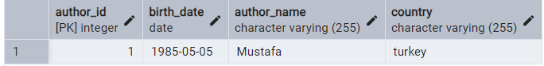
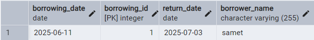
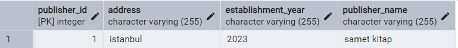
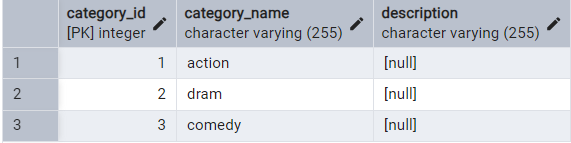
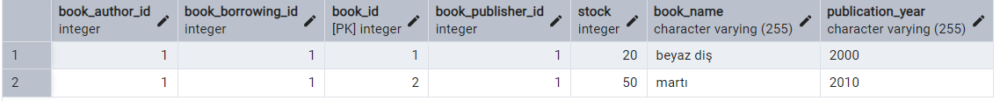
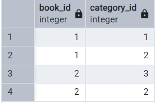

# SmartLibrary

SmartLibrary is a Java-based backend project designed to simulate a simple library management system using **JPA (Jakarta Persistence API)** and **Hibernate**. The project demonstrates the creation and management of entities such as books, authors, publishers, categories, and book borrowings.

## 🛠️ Technologies Used

- Java
- Maven
- JPA (Jakarta Persistence API)
- Hibernate (as JPA Provider)
- H2 Database (or any database configured in `persistence.xml`)
- Lombok

## 📁 Project Structure

```
src/
├── main/
│ ├── java/
│ │ └── dev/
│ │ └── patika/
│ │ ├── App.java
│ │ └── entities/
│ │ ├── Author.java
│ │ ├── Book.java
│ │ ├── BookBorrowing.java
│ │ ├── Category.java
│ │ └── Publisher.java
│ └── resources/
│ └── META-INF/
│ └── persistence.xml
```

## 📦 Entities

- **Author**: Represents book authors.
- **Book**: Represents library books and includes relationships to authors, categories, borrowings, and publishers.
- **BookBorrowing**: Represents a borrow record with borrow and return dates.
- **Category**: Represents genres or classifications of books.
- **Publisher**: Represents publishing houses.

## 🔄 Relationships

- One-to-Many: Author → Book, Publisher → Book, BookBorrowing → Book
- Many-to-Many: Book ↔ Category
- Many-to-One: Book → Author, Publisher, BookBorrowing

## Images
### authors table
  
### book_borrowing table
  
### publishers table
  
### categories table
  
### books table
  
### book_category table (created by hibarnate)
  
